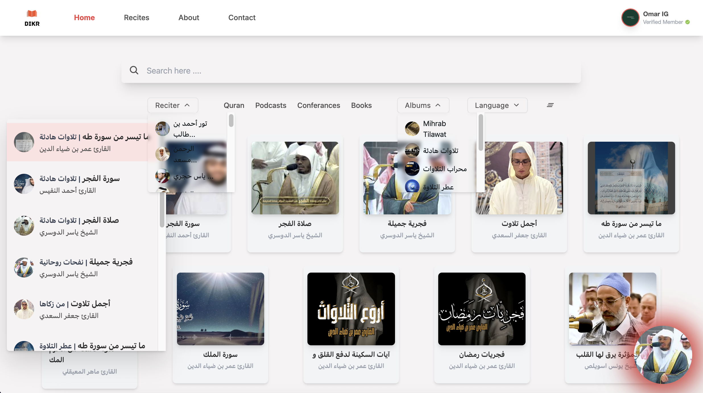
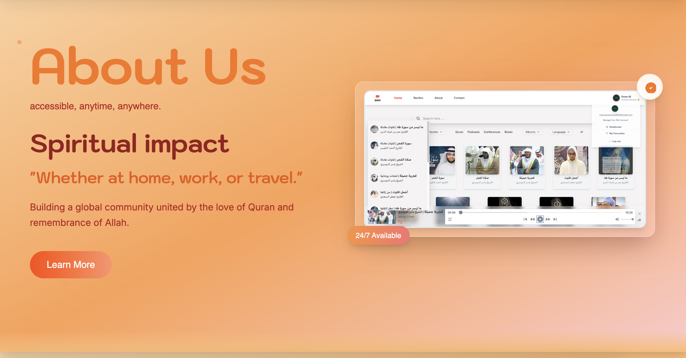
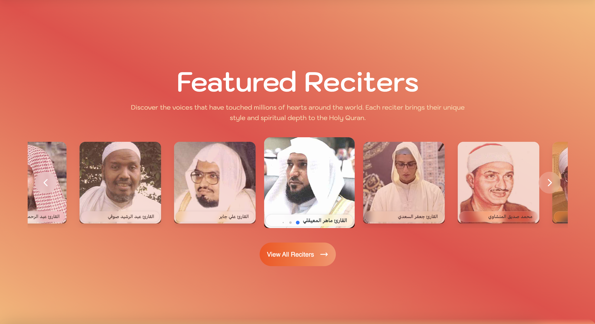
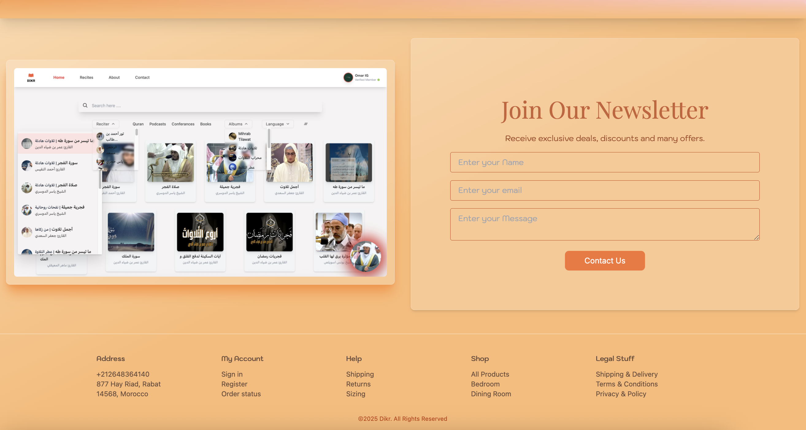
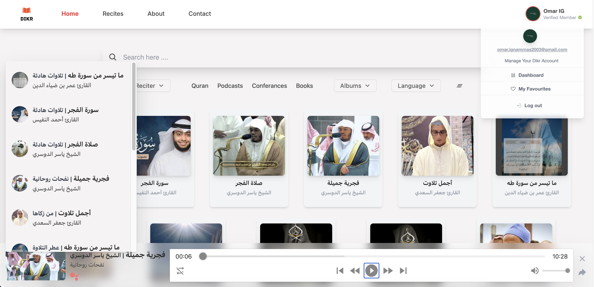
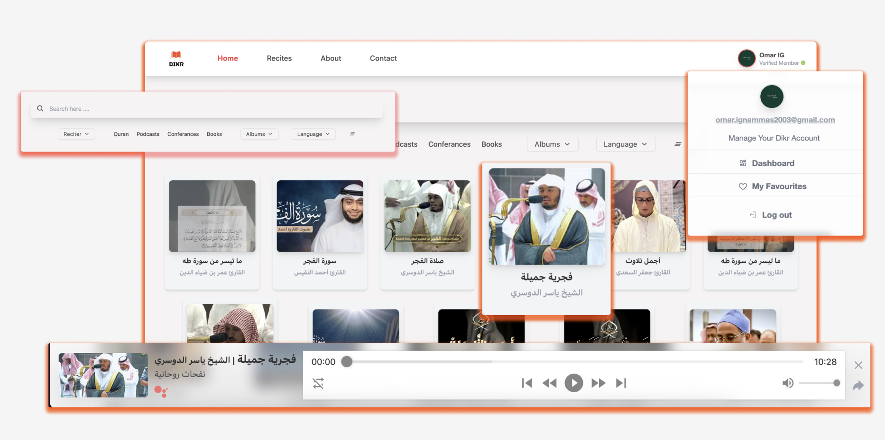
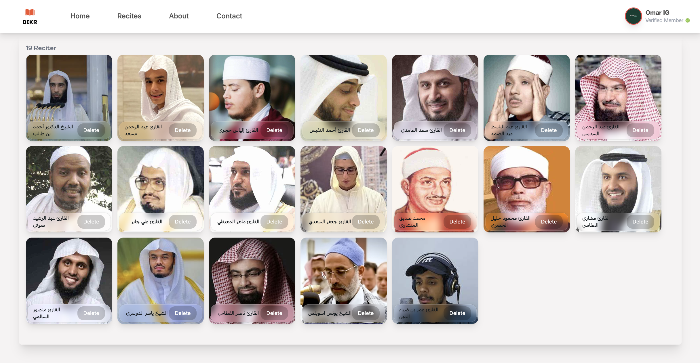
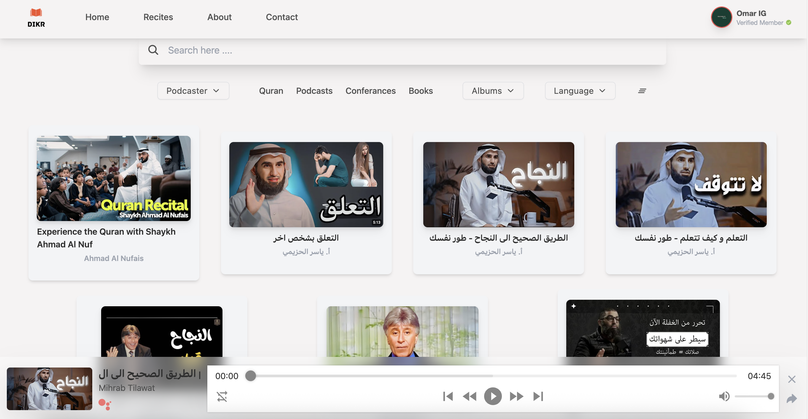

# WELCOME TO DIKR WEB APPLICATION 🕌📿🎧

---------------------------------------------------------------------------------------------------------------

## ABOUT DIKR
DIKR is your comprehensive digital spiritual companion, designed to support your spiritual development journey through the Holy Quran. Our application offers an immersive and personalized experience for listening, managing, and discovering Quranic recitations from around the world.

## PROJECT OVERVIEW
During my Journey, I developed this web application called Dikr as a complete resource for Quranic playlists, allowing users to listen, organize, and share recitations. The development of this application enabled me to apply my web development skills while exploring modern technologies such as React.js, Node.js, MongoDB, and Firebase.

## MAIN FEATURES

### **Home - Your Gateway to Spiritual Enlightenment 🏠**

### **Recitations - Personalized Playlists 🎵**

### **Reciters - Elevate Your Quranic Journey 👨‍🏫**

### **Audio Podcasts - Enrich Your Knowledge 🎙️**

### **Admin Dashboard - Complete Management 📊**

### **User Profile Management 👤**

## TECHNOLOGIES USED

### **Frontend:**
- **React.js** - JavaScript Framework for dynamic user interfaces
- **Component-Based Architecture** for reusable and maintainable code
- **React Hooks** for state management and lifecycle methods
- **Tailwind CSS** for responsive design without custom CSS
- **React Router** for navigation and routing
- **Context API** with reducer for centralized state management

### **Backend:**
- **Node.js** - Asynchronous and non-blocking runtime environment
- **Express.js** - Web framework for API development
- **RESTful API** architecture
- **JWT Authentication** for secure user sessions
- **Axios** for server-side data validation

### **Database:**
- **MongoDB** - NoSQL database for schema flexibility
- **Mongoose** - ODM for MongoDB integration
- **Indexing and pagination** for performance optimization
- **Cloud storage** for audio files

### **Cloud Services:**
- **Firebase** - Authentication and real-time database
- **Firebase Storage** - Multimedia file storage
- **Google Authentication** integration
- **Firebase Admin SDK** for server-side authentication

### **Development Tools:**
- **Yarn** - Package manager
- **Postman** - API testing
- **Git/GitHub** - Version control
- **Agile methodology** - Iterative development approach

## CONTRIBUTION

We welcome contributions from the community! See our contribution guide to get started.

---

